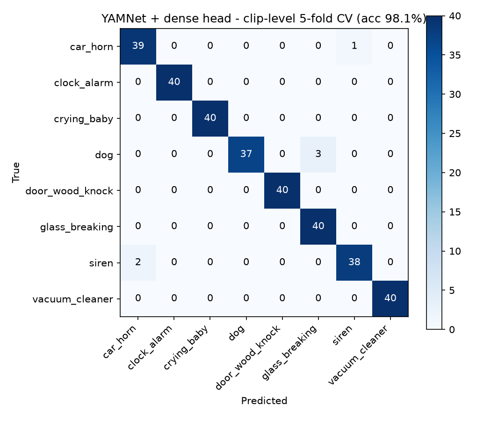
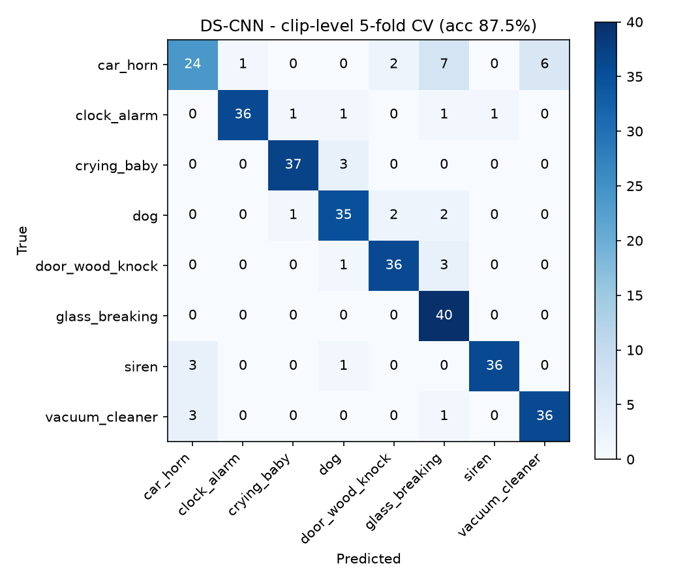
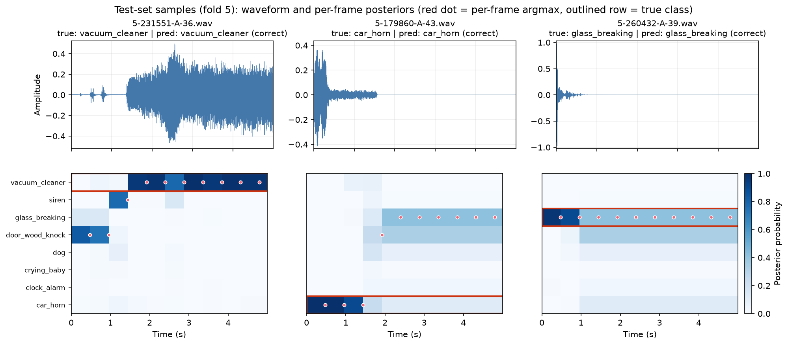
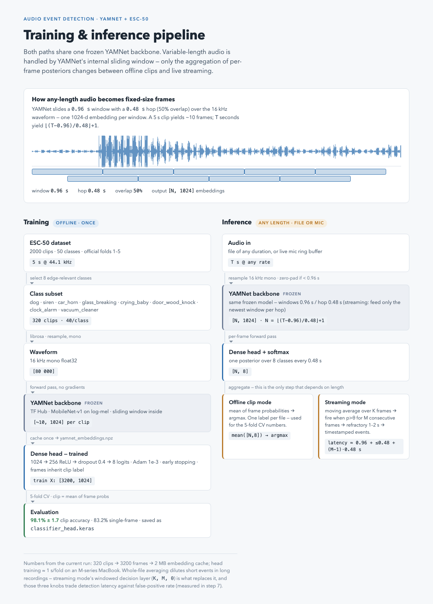

# Audio Event Detection (Edge-Oriented)

Edge-oriented audio event detection built on **YAMNet + ESC-50**. Roadmap
(from `guild_from_chatgpt.md`): select classes → fine-tune a YAMNet
classifier head → compare with a small custom DS-CNN → streaming inference →
TFLite export → INT8 quantization → benchmarks → macOS demo.

## Current status

- **Step 1 — class selection**: 8 ESC-50 classes relevant to a home/safety
  monitoring edge device: `dog`, `siren`, `car_horn`, `glass_breaking`,
  `crying_baby`, `door_wood_knock`, `clock_alarm`, `vacuum_cleaner`
  (40 clips each, 320 clips total).
- **Step 2 — YAMNet transfer learning**: per-frame 1024-d YAMNet embeddings
  (0.96 s window, 0.48 s hop) + a small dense head (1024 → 256 → 8),
  evaluated with the standard ESC-50 5-fold cross-validation. Clip
  predictions average the frame probabilities. **98.1% ± 1.7** clip accuracy.
- **Step 2.5 — custom DS-CNN baseline**: keyword-spotting-style
  depthwise-separable CNN (24k params) trained from scratch on log-mel
  patches with the same framing and CV protocol: **87.5% ± 4.3** clip
  accuracy — transfer learning buys ~10.6 points at 167× the parameter count.

## Results so far

| Model | Clip acc (5-fold CV) | Frame acc | Params | ms/frame (CPU)* |
|-------|---------------------|-----------|--------|-----------------|
| YAMNet (frozen) + dense head | **0.981 ± 0.017** | 0.832 | 4.0M | 14.8 |
| DS-CNN (custom, from scratch) | 0.875 ± 0.043 | 0.768 | **24k** | 13.8 |

\* Batch-1 Keras `predict()` — call overhead dominates both; the honest
latency comparison comes with TFLite export (steps 4–6).

| YAMNet + head | DS-CNN |
|---|---|
|  |  |

Per-frame posteriors on test clips — why clip-level averaging (and later
streaming smoothing) matters:



Full details and per-class metrics in [summary.md](summary.md).

## Pipeline



(Interactive version: https://claude.ai/code/artifact/0eef4fa5-f363-48db-ad40-375cba35cbb2)

## Setup

```bash
python3.12 -m venv .venv          # TensorFlow needs Python <= 3.12/3.13
source .venv/bin/activate
pip install tensorflow tensorflow-hub librosa soundfile scikit-learn pandas matplotlib
```

## Data

```bash
cd data
curl -sL -o esc50.zip https://github.com/karolpiczak/ESC-50/archive/master.zip
unzip -q esc50.zip && rm esc50.zip
```

## Run

```bash
source .venv/bin/activate
cd src
python extract_embeddings.py   # -> data/yamnet_embeddings.npz
python train_classifier.py     # -> results/, plots/confusion_matrix.png
python train_dscnn.py          # step 2.5 -> results/model_comparison.csv
```

## Layout

- `src/` — source code (`config.py`, `extract_embeddings.py`,
  `train_classifier.py`, `train_dscnn.py`, `plot_samples.py`)
- `data/` — ESC-50 dataset + cached embeddings (not checked in)
- `results/` — metrics, reports, saved classifier head (not checked in)
- `plots/` — confusion matrix and other figures
- `logs/` — run logs (not checked in)
